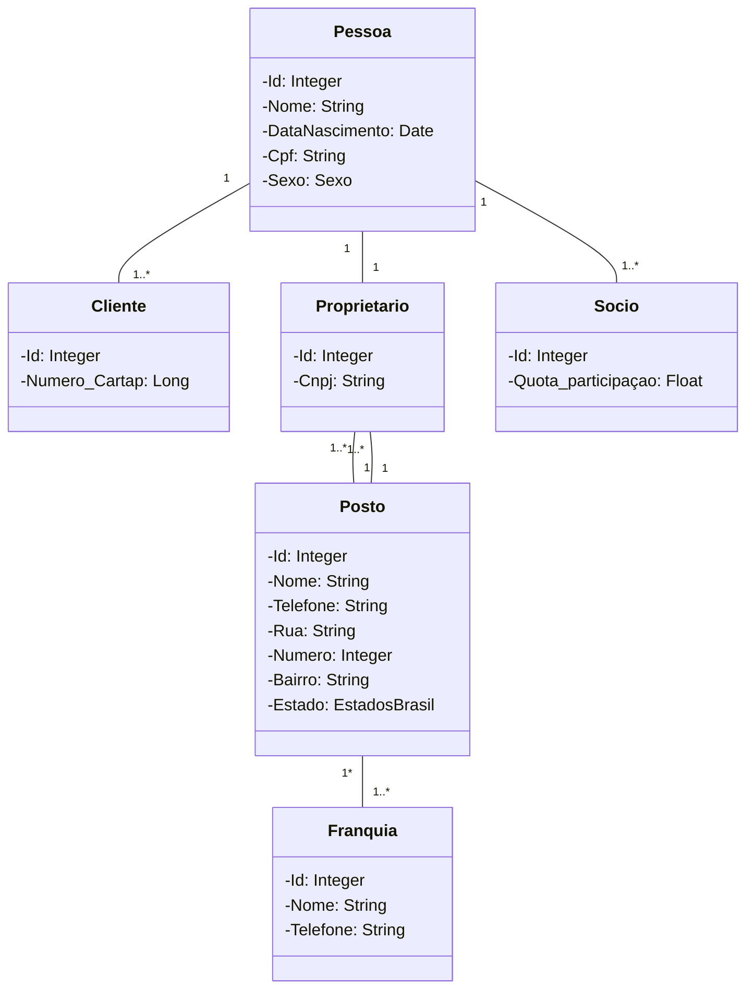

# seuposto

## Aplicação desenvolvida em Java + Spring Framework + JPA

## Aplicação voltada para ambiente de posto de gasolina, relacionando clientes, proprietários, sócios e franquias.

### Montei o esqueleto do código mas é necessário finalizar e otimizar queries e consultas jpql.
### Back-end sem implementação de testes ( Necessário estudo aprofundado )

	

